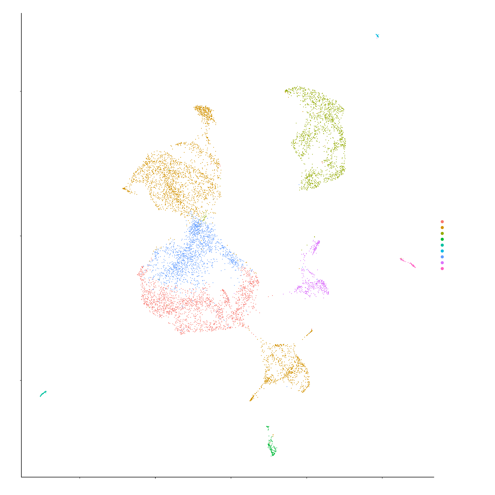
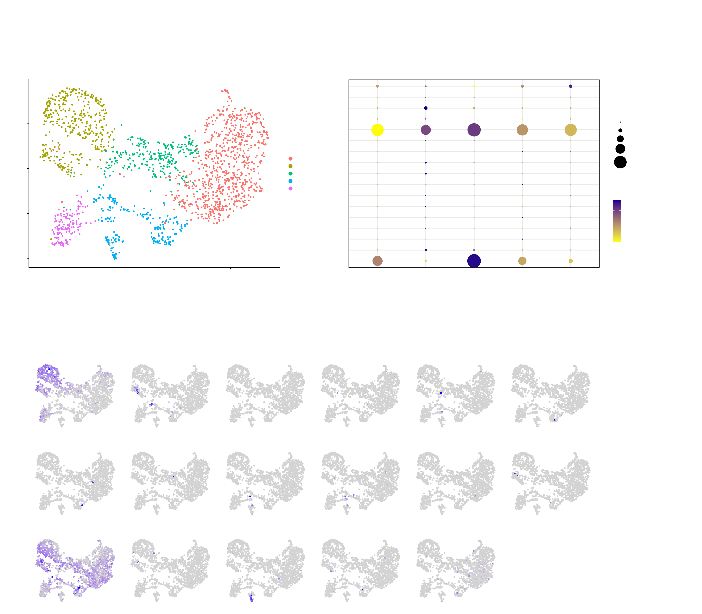
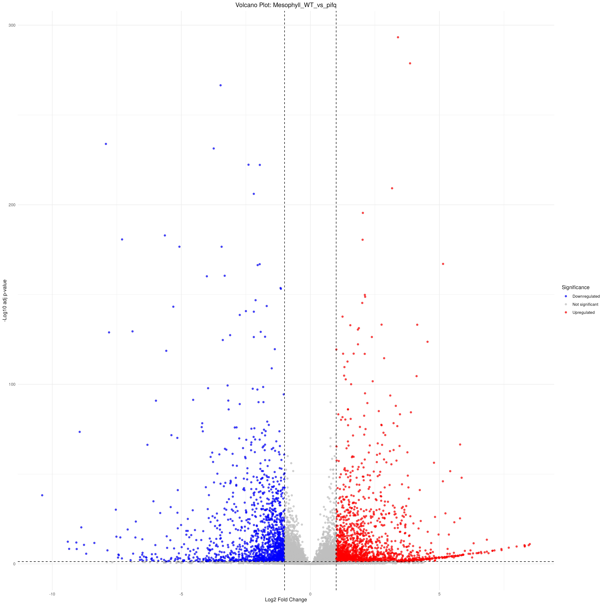

```{r setup, include=FALSE}
knitr::opts_chunk$set(
  echo = TRUE,
  eval = FALSE,
  message = TRUE,
  warning = TRUE,
  error = FALSE,
  strip_comments = TRUE
)

strip_inline_comment <- function(line) {
  chars <- strsplit(line, "", fixed = TRUE)[[1]]
  in_single <- FALSE
  in_double <- FALSE
  escaped <- FALSE

  for (i in seq_along(chars)) {
    ch <- chars[[i]]
    if (escaped) {
      escaped <- FALSE
    } else if (ch == "\\") {
      escaped <- TRUE
    } else if (ch == "'" && !in_double) {
      in_single <- !in_single
    } else if (ch == '"' && !in_single) {
      in_double <- !in_double
    } else if (ch == "#" && !in_single && !in_double) {
      return(trimws(substr(line, 1, i - 1), which = "right"))
    }
  }
  line
}

source_hook <- knitr::knit_hooks$get("source")
knitr::knit_hooks$set(source = function(x, options) {
  if (isTRUE(options$strip_comments)) {
    lines <- strsplit(paste(x, collapse = "\n"), "\n", fixed = TRUE)[[1]]
    lines <- vapply(lines, strip_inline_comment, character(1), USE.NAMES = FALSE)
    lines <- lines[!grepl("^\\s*$", lines)]
    x <- paste(lines, collapse = "\n")
  }
  source_hook(x, options)
})
```

\newpage

# Abstract {-}

**A stepwise framework for inferring gene regulatory networks and
pseudotime-based trajectories from single-cell RNA-sequencing data**

Riveras E.^1^, Vergara M.^1^, Moreno-Ramirez S.^2^, Gutiérrez R.A.^1^

^1^Departamento de Genética Molecular y Microbiología, Facultad de Ciencias
Biológicas, Pontificia Universidad Católica de Chile, Santiago, Chile.
Millennium Institute for Integrative Biology, Millennium Institute for Center
for Genome Regulation. ^2^Sainsbury Laboratory, University of Cambridge,
Bateman Street, Cambridge CB2 1LR, UK.

Plant development is a dynamic process in which new organs are continuously
formed throughout an individual's lifetime. This continuous production of new
organs enables plants to increase in size and generate tissues with diverse
physiological and functional capabilities. Single-cell RNA sequencing
(scRNA-seq) has emerged as a powerful approach for characterizing
cell-type-specific transcriptomes at high resolution across tissues and
species. However, the bioinformatics analyses required to extract biological
information from scRNA-seq datasets can be challenging for researchers without
formal training in bioinformatics. Here, we provide a step-by-step workflow
for inferring gene regulatory networks and pseudotime-based developmental
trajectories from scRNA-seq data. To facilitate the implementation and
reproducibility of these analyses, we provide a Docker image and a GitHub
repository (github.com/laboratoriorgit-lang/SingleCell) containing all
scripts, helper functions, reference files, container configuration, and
environment YAML files. The workflow was applied to publicly available
scRNA-seq data from *Arabidopsis thaliana* seedlings and enables the
identification of differentially expressed genes (DEGs) across cell types,
gene regulatory networks, and developmental trajectories associated with
epidermal differentiation. Although this guide focuses on scRNA-seq analysis
in *A. thaliana*, the workflow can be adapted to other organisms using
appropriate reference genomes, genome annotations, and experimental designs.

\newpage

# Introduction {-}

Plant organs are not laid down once during embryogenesis but are produced
continuously across the plant's life, from meristems that generate new roots,
leaves and flowers on demand. This ongoing organogenesis depends on precisely
coordinated, cell-type-specific gene expression programs, as neighboring
cells within the same tissue can follow markedly different transcriptional
trajectories depending on their developmental origin, position, and stage of
differentiation. Bulk RNA-seq, which averages expression across every cell in
a sample, is poorly suited to resolving this heterogeneity: rare cell types
are diluted out, and transitions between cell states are collapsed into a
single average that may not represent any individual cell.

Single-cell RNA sequencing (scRNA-seq) addresses this limitation directly by
profiling transcriptomes one cell at a time, making it possible to resolve
cell-type identity, cell-state transitions, and developmental trajectories
within a tissue at a resolution bulk approaches cannot reach. Once cells are
clustered and annotated, the same data can support several complementary
analyses: differential expression between cell types or genotypes, inference
of gene regulatory networks from co-expression patterns, and reconstruction
of pseudotime trajectories that order cells along a developmental or
differentiation axis. In practice, however, each of these steps involves a
distinct set of tools, file formats and statistical choices, and combining
them into a coherent, reproducible pipeline requires computational expertise
that is not always available in plant biology labs, which can be a real
barrier to adopting scRNA-seq despite its potential.

This guide provides a complete, reproducible workflow that carries scRNA-seq
data from raw sequencing reads through all of these downstream analyses.
Starting from FASTQ files, Cell Ranger is used to generate per-cell count
matrices (Part 1). These matrices are then loaded into R, where cells are
filtered, doublets are removed, samples are merged and batch-corrected with
Harmony, and clusters are annotated to cell types using literature-curated
marker genes (Part 2). From the annotated object, the pipeline builds
pseudobulk profiles per cell type to identify differentially expressed genes
between genotypes, runs GO enrichment on those gene sets, and infers a
transcription-factor co-expression network to highlight candidate regulators
(Part 3). Finally, the workflow switches to Python (scanpy, Palantir,
scFates) to reconstruct pseudotime trajectories within a selected cell
population, order cells along that trajectory, and identify genes whose
expression trends define it (Part 4). Every step is packaged as a single
container image, so the same software environment — R, Python, and every
package version — is available to anyone who pulls the image, removing a
major source of "works on my machine" irreproducibility.

To illustrate the complete workflow end to end, this document applies it to a
public scRNA-seq dataset comparing wild-type and *pifq* mutant *Arabidopsis
thaliana* seedlings, from raw Cell Ranger processing through cell-type
annotation, differential expression, regulatory network inference, and a
pseudotime trajectory of epidermal differentiation. Although the example
organism is *A. thaliana*, none of the workflow logic is specific to it: the
same steps apply to other species by substituting the reference genome,
annotation, and marker gene set used for cell-type calling.

## About this document {-}

This methods-paper R Markdown documents the full WT vs pifq workflow: two
samples, `WT` and `pifq`, processed and integrated together, then carried
through three chapters — single-cell preprocessing, clustering and annotation
(Part 2); pseudobulk differential expression, GO and the co-expression network
(Part 3); and pseudotime trajectory analysis (Part 4). The code blocks are shown
exactly as in the methods paper (not executed inline); the figures below are the
**real outputs** of a fresh run of `workflow/step1_singlecell.R`,
`workflow/step2_degs.R` and `workflow/step3_pseudotime.py`, written to a separate
`results_rerun/` directory using the bibliography annotation (`celltype`).

The active annotation path is bibliography-based (`biblio_marks.txt` ->
`celltype_curated`). Reference-transfer annotation is not part of this draft.

## Minimum computing requirements {-}

The table below summarizes the computing requirements for running the full
pipeline on a personal computer, from raw FASTQ through the downstream Seurat/R
and Python workflow. These are not hard limits; below them the
pipeline still runs, just slower, and heavier steps (Cell Ranger, merging,
PCA/UMAP) risk stalling or exhausting memory.

| Component | Minimum | Recommended |
|---|---:|---:|
| CPU cores | 4 | 16 or more |
| RAM | 32 GB | 64-128 GB for merged multi-sample objects |
| Disk space | 80 GB free | 100 GB free |
| Container runtime | Any OCI-compatible runtime (e.g. Docker) | Docker or Singularity/Apptainer |

This workflow is packaged as a single public image (`psblab/scrnaseq:latest`,
on Docker Hub); the `docker-compose` YAML used to build and run it is kept in
the repository. Any container runtime able to run that image works; the setup
below covers both Docker and Singularity/Apptainer (the latter common on HPC
clusters, where Docker is usually not permitted).

Small pilot datasets can be run on a laptop or desktop if memory is sufficient.
For full experiments, repeated clustering sweeps, Cell Ranger processing from
FASTQ, or large merged Seurat objects, a server or external cluster is strongly
recommended. Cell Ranger is CPU- and memory-intensive and is not installed
inside the downstream `psblab/scrnaseq:latest` Docker image.

## Recommended: persistent terminal sessions with tmux or screen {-}

Several steps in this pipeline run for a long time without any interaction —
Cell Ranger takes 30-60 minutes per sample, and the R/Python clustering and
pseudotime steps can run for hours on large merged objects. If these are
launched directly in an SSH session and the connection drops (network hiccup,
laptop sleep, closed terminal), the process is killed along with it.

Running everything inside a `tmux` or `screen` session avoids this: the
session keeps running on the server after you disconnect, and can be
reattached later — from the same machine or a different one — to check
progress or pick up where things were left off. This is strongly recommended
any time this pipeline runs on a remote server or HPC cluster, and is still
useful on a local machine to keep a session alive while doing other work.

Either tool works; `tmux` is used in the examples below.

```bash
tmux new -s scrnaseq     # start a new named session
# ... run Cell Ranger, Docker/Singularity, R, etc. inside it ...
# detach without stopping anything: Ctrl-b, then d

tmux attach -t scrnaseq  # reattach later
tmux ls                  # list running sessions
```

This pipeline's R/Python environment ships as a single public container image
(`psblab/scrnaseq:latest`, Docker or Singularity/Apptainer). It mounts the
cloned repository as `/workspace`, so results are written back into the repo.
Always pull the image rather than rebuilding it from the `Dockerfile`, so
everyone gets the exact tested package versions (details and commands in
"Container startup", Part 1).

**Once inside a container (Docker or Singularity) shell, stay inside it for
the rest of the work.** The R and Python packages this pipeline needs
(Seurat, scanpy, Palantir, scFates, etc.) are installed only inside the
`psblab/scrnaseq:latest` image — they are not available on the bare host.
Leaving the container shell (e.g. `exit`, or the shell dying) means the next
command expecting those packages will fail. Pair this with tmux/screen: open
a session, enter the container from inside it, and do the rest of the R/Python
work (Parts 2-4) without leaving either until finished.

Installation instructions for tmux, screen, Docker and Singularity/Apptainer
are in the Supplementary section at the end of this document.

\newpage

# Part 1 - Environment and raw data

## Clone the repository

Choose or create a working directory, then clone the pipeline repository
into it:

```bash
mkdir -p ~/my-analysis
cd ~/my-analysis
git clone https://github.com/laboratoriorgit-lang/SingleCell.git
cd SingleCell
```

All paths referenced later in this document (`workflow/`) are relative to
this cloned repository. Its layout is:

```text
SingleCell/
|-- Dockerfile
|-- docker-compose.yml
|-- README.md
|-- data/
|   |-- AtTFDB_loci.txt
|   |-- biblio_marks.txt
|   |-- Arabidopsis_thaliana_TAIR10.1_Araport11_genome.fasta.gz
|   `-- Arabidopsis_thaliana_TAIR10.1_Araport11_annotation.gtf.gz
`-- workflow/
    |-- load_libraries.R                 # R packages
    |-- load_libraries_python.py         # Python packages
    |-- ScRNA_Analysis_Functions.R       # helper functions (Steps 1-2)
    |-- ScRNA_Pseudotime_Functions.py    # helper functions (Step 3)
    |-- step0_cellranger.sh              # Part 1 - Cell Ranger (bash)
    |-- step1_singlecell.R               # Part 2 - single-cell analysis
    |-- step2_degs.R                     # Part 3 - pseudobulk DE + GO
    `-- step3_pseudotime.py              # Part 4 - pseudotime (Python)
```

The bibliography marker table (`data/biblio_marks.txt`) is part of the
repository for this WT vs pifq run (see Section 1).

## Container startup (Docker or Singularity)

The container mounts the cloned repository itself as `/workspace`, so results
are written back into the repository (`results/`). Since results are not
pushed upstream, this is not a problem. The same public image runs under either
runtime; always pull it rather than rebuilding from the `Dockerfile`, so every
user gets the exact tested package versions.

**Docker.** Mount the cloned repository and open a shell:

```bash
docker run -it --rm \
  -v $(pwd):/workspace \
  psblab/scrnaseq:latest /bin/bash
```

Or, from inside the cloned repository, `docker compose run r` uses the bundled
`docker-compose.yml` (same image, same `/workspace` mount). On the current
server the Docker container is already running and the project is mounted at
`/workspace`.

**Singularity / Apptainer.** No root is required. Convert the public Docker Hub
image to a local `.sif` once, then open a shell binding the repository to
`/workspace`:

```bash
singularity build scrnaseq.sif docker://psblab/scrnaseq:latest
singularity exec --bind $(pwd):/workspace --pwd /workspace scrnaseq.sif /bin/bash
```

Apptainer imports the image environment, so the bundled Python (`/opt/venv`) and
R stay on `PATH`, and it runs as the invoking user, so files under `results/`
are owned by that user rather than by root. The `--pwd /workspace` flag starts
the shell inside the bound repository (otherwise Apptainer warns that the host
working directory does not exist in the container and falls back to `$HOME`).

**Stay inside this shell for Parts 2-4.** All R and Python packages this
pipeline needs are installed only inside this container image; running them
outside of it fails. Start this shell inside a `tmux`/`screen` session (see
above) so it survives a dropped connection.

## Raw data download and Cell Ranger processing

**Run this whole section outside the Docker container**, on a host, server, or
HPC where Cell Ranger is installed. Cell Ranger is *not* bundled inside the
`psblab/scrnaseq:latest` image (that image only covers the downstream R /
Python workflow), so running `cellranger` inside the container returns
`command not found`. Write the Cell Ranger outputs into the cloned repository
directory so they are visible from inside the container (which mounts that same
directory as `/workspace`).

**Install Cell Ranger 9.0.1** (proprietary 10x Genomics software; this workflow
uses version 9.0.1). Get it from the 10x Genomics *previous versions* page:
https://www.10xgenomics.com/support/software/cell-ranger/downloads/previous-versions

1. Log in and accept the license.
2. Find **Cell Ranger 9.0.1** and copy its `curl` command.
3. That URL is signed and time-limited (it carries an `Expires=` timestamp tied
   to your account), so paste the current one — it cannot be hard-coded here or
   reused later. A plain `git clone` of the source repo does *not* give a
   ready-to-run binary.

Then extract it and add it to your `PATH`:

```bash
# Paste the signed curl command for 9.0.1 from the 10x page, e.g.:
curl -o cellranger-9.0.1.tar.gz "https://cf.10xgenomics.com/releases/cell-exp/\
cellranger-9.0.1.tar.gz?Expires=...&Key-Pair-Id=...&Signature=..."

tar -xzvf cellranger-9.0.1.tar.gz
export PATH=$PWD/cellranger-9.0.1/bin:$PATH
cellranger --version
```

The single-cell workflow starts from Cell Ranger output, specifically the
`outs/filtered_feature_bc_matrix/` folder for each sample. If only raw FASTQ
files are available, first download or stage the FASTQs, then run Cell Ranger
for each sample before starting the R workflow.

The WT vs pifq FASTQ files used in this run are public data from
[Han et al., 2023, *Nature Plants*](https://www.nature.com/articles/s41477-023-01544-4#data-availability),
deposited at the CNCB Genome Sequence Archive under BioProject
[PRJCA016521](https://ngdc.cncb.ac.cn/bioproject/browse/PRJCA016521), run
accession `CRA010863`:

| Sample | Run accession | Files |
|---|---|---|
| ScWT | CRR775298 | `CRR775298_f1.fastq.gz`, `CRR775298_r2.fastq.gz` |
| Scpifq | CRR775297 | `CRR775297_f1.fastq.gz`, `CRR775297_r2.fastq.gz` |

Download the reads, then rename/symlink them to the naming Cell Ranger
expects (`<sample>_S1_L001_R1/R2_001.fastq.gz`):

```bash
mkdir -p /workspace/fastq/CRA010863

wget -c -P /workspace/fastq/CRA010863 \
  ftp://download.big.ac.cn/gsa2/CRA010863/CRR775298/CRR775298_f1.fastq.gz
wget -c -P /workspace/fastq/CRA010863 \
  ftp://download.big.ac.cn/gsa2/CRA010863/CRR775298/CRR775298_r2.fastq.gz
wget -c -P /workspace/fastq/CRA010863 \
  ftp://download.big.ac.cn/gsa2/CRA010863/CRR775297/CRR775297_f1.fastq.gz
wget -c -P /workspace/fastq/CRA010863 \
  ftp://download.big.ac.cn/gsa2/CRA010863/CRR775297/CRR775297_r2.fastq.gz

cd /workspace/fastq/CRA010863
ln -s CRR775298_f1.fastq.gz ScWT_S1_L001_R1_001.fastq.gz
ln -s CRR775298_r2.fastq.gz ScWT_S1_L001_R2_001.fastq.gz
ln -s CRR775297_f1.fastq.gz Scpifq_S1_L001_R1_001.fastq.gz
ln -s CRR775297_r2.fastq.gz Scpifq_S1_L001_R2_001.fastq.gz
```

After FASTQs are available, run Cell Ranger for each sample. Cell Ranger itself
is not redistributed in this repository; download it from the official 10x
Genomics GitHub release
(https://github.com/10XGenomics/cellranger/releases/tag/cellranger-9.0.1) and
add it to your `PATH`. Run all commands in this section from the cloned
repository directory, on a host/server/HPC where Cell Ranger is installed (not
inside the container).

The reference genome (TAIR10.1) and Araport11 annotation ship compressed in the
repository under `data/`, so no download is needed. Decompress them and build
the Cell Ranger reference:

```bash
gunzip -k data/Arabidopsis_thaliana_TAIR10.1_Araport11_genome.fasta.gz
gunzip -k data/Arabidopsis_thaliana_TAIR10.1_Araport11_annotation.gtf.gz

cellranger mkref \
  --genome=Ara \
  --fasta=data/Arabidopsis_thaliana_TAIR10.1_Araport11_genome.fasta \
  --genes=data/Arabidopsis_thaliana_TAIR10.1_Araport11_annotation.gtf
```

Run Cell Ranger counts for each sample:

```bash
cellranger count --localcores=10 --id=ScWT --fastqs=/workspace/fastq/CRA010863 \
  --sample=ScWT --transcriptome=Ara --create-bam false

cellranger count --localcores=10 --id=Scpifq --fastqs=/workspace/fastq/CRA010863 \
  --sample=Scpifq --transcriptome=Ara --create-bam false
```

`--localcores=10` is used here as a portable default that keeps the example
consistent across this report and the accompanying workflow scripts; it is not
a hard requirement. Cell Ranger will happily use more or fewer cores, so raise
or lower this value to match the number of CPU cores actually available on
the machine running the pipeline (see the Recommended column above for
guidance).

Use the resulting `filtered_feature_bc_matrix/` path in the sample manifest in
Section 1.

\newpage

# Part 2 - Single-cell analysis in R

From this point on, the pipeline runs in R inside the Docker container.
Start R:

```bash
R
```

The next two steps, Configuration and Initialization, set up the paths and
helper functions used by every section that follows.

## Configuration


This block defines the main paths used by the pipeline: the working directory, the folder where the workflow scripts are stored, and the folder where all results will be written. Edit these values before running the analysis if your project is mounted in a different location.


```{r configuration}
# CONFIGURATION - Edit only this block before running the pipeline
# =============================================================================

# Folder containing the pipeline helper scripts.
# This tells R where to find files such as load_libraries.R and
# ScRNA_Analysis_Functions.R. Inside the container, the cloned repository
# is mounted as /workspace.
PIPELINE_DIR <- "/workspace/workflow"

# Working directory for the analysis.
# Input folders are resolved relative to DATA_DIR, and all result files
# will be written to DATA_DIR/results/<step>/
DATA_DIR   <- "/workspace/."
base_dir   <- file.path(DATA_DIR, "results")

# =============================================================================
```


## Initialization


This block prepares the R session before running the analysis. It loads the
pipeline helper scripts, sets a fixed random seed for reproducibility, configures
Seurat compatibility options, moves R into the project working directory, and
creates the output folders used by the rest of the workflow. The seed is
important because some analysis steps include random components; keeping it fixed
helps obtain comparable results when the pipeline is rerun.


```{r initialization}
# INITIALIZATION
# =============================================================================

# -- Load helper scripts --------------------------------------------------------
# load_libraries.R loads the required R packages.
# ScRNA_Analysis_Functions.R loads the custom functions used in the workflow.
source(file.path(PIPELINE_DIR, "load_libraries.R"))
source(file.path(PIPELINE_DIR, "ScRNA_Analysis_Functions.R"))

# Set a fixed random seed so steps with random components are reproducible.
# Using the same seed helps obtain comparable results when rerunning the pipeline.
set.seed(1807)

# Enable compatibility behavior required by Seurat 5.
options(Seurat.allow.s4 = FALSE)

# Set the working directory for the analysis.
# From this point, relative paths are interpreted from DATA_DIR.
setwd(DATA_DIR)

# -- Create per-step output directories ----------------------------------------
# create_pipeline_dirs() creates folders such as 01_qc, 02_clustering, etc.
# list2env() loads their paths into the R session as variables such as dir_01.
list2env(create_pipeline_dirs(base_dir), envir = .GlobalEnv)

# output_dir is the variable used by plotting/saving helper functions.
# It is updated at the start of each section to point to the correct folder.
output_dir <- base_dir


# =============================================================================
# ########################  PART 1 - SINGLE-CELL ANALYSIS  ####################
# =============================================================================
```

After this block runs, the R session is ready to execute the analysis sections.
The helper functions are available, the project paths are fixed, and the results
folders have been created. Each following section only needs to set `output_dir`
to the corresponding folder before saving figures or objects.

\newpage

## Section 1 - Data loading and pre-filter QC

This section loads each sample from the Cell Ranger output and creates the first
quality-control plots before filtering.

To use this block, edit the sample list with one entry per sample:

- `file`: path to the `filtered_feature_bc_matrix` folder, relative to
  `DATA_DIR`.
- `label`: short sample name used in plots and object labels.
- `condition`: experimental group or treatment condition.

Then edit `colors`, assigning one color to each sample `label`. These colors are
used in the QC plots and later visualizations.

The mitochondrial and chloroplast gene patterns tell the pipeline how to identify
organellar reads. For Arabidopsis, mitochondrial genes usually start with `ATMG`
and chloroplast genes usually start with `ATCG`; those are the defaults used in
this report.

After running the block, the pipeline creates one raw Seurat object per sample
and saves the pre-filter QC plot in `results/01_qc/qc_prefilter.pdf`. This plot
is used to inspect sample quality before choosing filtering thresholds in the
next section.

```{r section_01_data_loading_and_pre_filter_qc}
# SECTION 1 - DATA LOADING AND PRE-FILTER QC
# =============================================================================
# Each sample is loaded from its input file and mitochondrial / chloroplast
# read fractions are computed per cell to guide filtering thresholds in
# Section 2. Pre-filter violin plots are saved to 01_qc/.
#
# +- CHANGE FOR YOUR ORGANISM --------------------------------------------------
#   Arabidopsis : mt_pattern = "^ATMG"  |  cp_pattern = "^ATCG"
#   Human       : mt_pattern = "^MT-"   |  cp_pattern = NULL
#   Mouse       : mt_pattern = "^mt-"   |  cp_pattern = NULL
# +-----------------------------------------------------------------------------
output_dir <- dir_01

# -- Sample manifest (CellRanger filtered_feature_bc_matrix) ------------------
# Add one entry per sample. Each entry needs:
#   file      - path to the filtered_feature_bc_matrix/ directory (relative to DATA_DIR)
#   label     - unique name for this sample (appears in all plots)
#   condition - experimental group this sample belongs to
samples <- list(
  list(
    file      = "ScWT/outs/filtered_feature_bc_matrix",
    label     = "WT",
    condition = "WT"
  ),
  list(
    file      = "Scpifq/outs/filtered_feature_bc_matrix",
    label     = "pifq",
    condition = "pifq"
  )
)


# -- Plot colors (one color per sample label) -----------------------------------
colors <- c(
  "WT"  = "#66c2a5",
  "pifq"  = "#fc8d62"
)


mt_pattern <- "^ATMG"  # Arabidopsis mitochondrial genes
cp_pattern <- "^ATCG"  # Arabidopsis chloroplast genes


# Load all samples using the helper function
seurat_list_raw <- load_seurat_samples(samples = samples,
                                       DATA_DIR = DATA_DIR,
                                       mt_pattern = mt_pattern,
                                       cp_pattern = cp_pattern)

plot_qc_batch(seurat_list_raw, colors, "qc_prefilter.pdf")


# =============================================================================

message("\nOK SECTION 1 COMPLETE: QC pre-filter plots saved")
```

Representative output from Section 1:

{width=30%}

\newpage

## Section 2 - Cell filtering and doublet detection

This section filters low-quality cells and then runs doublet detection. The code
shown here uses two thresholds: cells must have more than 200 detected genes
(`min_features = 200`) and less than 5% mitochondrial reads (`max_mt = 5`).

The filtering function also accepts extra variables that are not used explicitly
in this example:

- `max_features`: maximum number of detected genes per cell.
- `min_counts`: minimum total RNA counts per cell.
- `max_counts`: maximum total RNA counts per cell.
- `max_cp`: maximum chloroplast percentage.
- `run_doubletfinder`: whether DoubletFinder should be run after filtering.

These extra options are useful when the QC plots show cells with very low
complexity, unusually high gene or UMI counts, high chloroplast signal, or when
you want to disable doublet detection for a quick test.

After running the block, the pipeline saves a post-filter QC plot in
`results/01_qc/qc_postfilter.pdf` and stores the filtered sample list in
`results/objects/seurat_list_postfilter.rds`. This saved object is used by the
next section.

```{r section_02_cell_filtering_and_doublet_detection}
output_dir <- dir_01

seurat_list <- filter_seurat_samples(seurat_list_raw, min_features = 200, max_mt = 5)

plot_qc_batch(seurat_list, colors, "qc_postfilter.pdf")

saveRDS(seurat_list, file.path(dir_objects, "seurat_list_postfilter.rds"))

message("\nOK SECTION 2 COMPLETE: filtering and doublet detection complete")
```

Representative output from Section 2:

{width=30%}

\newpage

## Section 3 - Merge and initial preprocessing

This section combines the filtered samples into one Seurat object and performs
the first standard preprocessing steps. At this point, the samples are merged but
not yet batch-corrected.

The workflow normalizes the data, identifies informative genes, scales the
expression matrix, summarizes the main sources of variation with PCA, and creates
a first UMAP visualization. This UMAP is useful for checking how the samples look
before Harmony correction.

The output is saved as `results/objects/ath_sc_preharmony.rds`, and the UMAP
before batch correction is saved as `results/01_qc/umap_preharmony.pdf`.

```{r section_03_merge_and_initial_preprocessing}
output_dir <- dir_01

ath_sc <- reduce(seurat_list, merge) %>%
  NormalizeData(verbose = FALSE) %>%
  FindVariableFeatures(
    selection.method = "vst", nfeatures = 2000, verbose = FALSE
  ) %>%
  ScaleData(verbose = FALSE) %>%
  RunPCA(npcs = 30, verbose = FALSE) %>%
  RunUMAP(reduction = "pca", dims = 1:30, verbose = FALSE)

save_pdf(
  DimPlot(ath_sc, group.by = "orig.ident", cols = colors),
  "umap_preharmony.pdf"
)

saveRDS(ath_sc, file.path(dir_objects, "ath_sc_preharmony.rds"))

message("\nOK SECTION 3 COMPLETE: merge and preprocessing complete")
```

Representative output from Section 3:

{width=30%}

\newpage

## Section 4 - Harmony batch correction

This section applies Harmony to reduce sample-specific batch effects after the
initial merge. The correction is done using the sample identity stored in
`orig.ident`.

After Harmony, the UMAP is recalculated using the corrected representation. This
second UMAP helps check whether samples mix better while still preserving
biological structure.

The corrected object is saved as `results/objects/ath_sc_postharmony.rds`, and
the post-Harmony UMAP is saved as `results/01_qc/umap_postharmony.pdf`.

```{r section_04_harmony_batch_correction}
output_dir <- dir_01

ath_sc <- ath_sc %>%
  RunHarmony("orig.ident", plot_convergence = FALSE) %>%
  RunUMAP(reduction = "harmony", dims = 1:30, verbose = FALSE)

save_pdf(
  DimPlot(ath_sc, group.by = "orig.ident", cols = colors),
  "umap_postharmony.pdf"
)

saveRDS(ath_sc, file.path(dir_objects, "ath_sc_postharmony.rds"))

message("\nOK SECTION 4 COMPLETE: Harmony integration complete")
```

Representative output from Section 4:

{width=30%}

\newpage

## Section 5 - Resolution optimization

This section helps choose a reasonable clustering resolution before assigning the
final clusters. The `resolutions_test` vector contains the candidate resolutions
that will be tested. Lower values produce fewer, broader clusters; higher values
produce more, smaller clusters.

The section generates two diagnostic plots: an elbow plot and a clustree. The
elbow plot gives a broad view of how many groups are supported by the data. The
clustree shows how clusters split or remain stable across the tested resolution
values. Together, these plots help avoid choosing a resolution that is too coarse
or too fragmented.

The outputs are saved in `results/02_clustering/` as `elbow_plot.pdf` and
`clustree2.pdf`. The underlying PCA dimensions, k-means settings, and neighbor
count are fixed inside `plot_resolution_elbow()` and `run_resolution_sweep()`
(`workflow/ScRNA_Analysis_Functions.R`) and rarely need changing; the only
thing to edit here is `resolutions_test`.

```{r section_05_resolution_optimization}
resolutions_test <- c(0.15, 0.35, 0.45, 0.55, 1.0)

output_dir <- dir_02

plot_resolution_elbow(ath_sc, output_dir = output_dir)

clu <- run_resolution_sweep(ath_sc, resolutions = resolutions_test, output_dir = output_dir)

message("\nOK SECTION 5 COMPLETE: elbow plot and clustree saved")
```

Representative outputs from Section 5:

```{=latex}
\begin{center}
```
{width=30%} {width=30%}
```{=latex}
\end{center}
```

\newpage

## Section 6 - Final clustering

This section applies the final clustering resolution chosen after inspecting the
diagnostic plots from Section 5. The value is set in `cluster_resolution`.

To use this block, first look at the elbow plot and clustree from Section 5, then
choose the resolution that gives a reasonable number of stable clusters. Lower
values produce fewer, broader clusters; higher values produce more, smaller
clusters.

After running this block, each cell receives a final Seurat cluster ID stored in
`seurat_clusters`. These numeric clusters are the starting point for cell-type
annotation in the next section.

The output figure is a UMAP colored by final cluster number, saved as
`results/02_clustering/umap_seuratclusters.pdf`.

```{r section_06_final_clustering}
cluster_resolution <- 0.35
output_dir <- dir_02

ath_sc <- ath_sc %>%
  RunUMAP(reduction = "harmony", dims = 1:30, verbose = FALSE) %>%
  FindNeighbors(reduction = "harmony", dims = 1:30, k.param = 20, verbose = FALSE) %>%
  FindClusters(resolution = cluster_resolution, algorithm = 4, verbose = FALSE)

Idents(ath_sc) <- "seurat_clusters"
save_pdf(
  DimPlot(ath_sc, group.by = "seurat_clusters", label = TRUE),
  "umap_seuratclusters.pdf"
)

message("\nOK SECTION 6 COMPLETE: final clustering complete")
```

Representative output from Section 6:

{width=30%}

\newpage

## Section 7 - Cell-type annotation

This section assigns biological cell-type labels to the clusters using a marker
gene table from the literature. The marker file is read from
`data/biblio_marks.txt`.

The pipeline first finds marker genes for the dataset, then compares those
markers with the bibliography table to assign a `celltype` label. The dotplot is
used to inspect whether the expected marker genes support the assigned labels.

The marker table is saved in `results/03_annotation/FindAllMarkers.tsv`, and the
main figures are saved as `dotplot_marker_table_annotation_biblio.pdf` and
`umap_annotation_biblio.pdf`.

```{r section_07_cell_type_annotation}
output_dir <- dir_03

biblio_marks_file <- file.path(DATA_DIR, "data", "biblio_marks.txt")
marker_table <- read.table(
  biblio_marks_file, header = TRUE, sep = "\t", quote = ""
)

markers <- find_markers(
  ath_sc,
  output_file = file.path(output_dir, "FindAllMarkers.tsv")
)

ath_sc <- annotate_by_markers(
  ath_sc, markers,
  reference_file = biblio_marks_file
)

plot_marker_dotplot(
  ath_sc,
  marker_table,
  annot_col = "celltype",
  outfile   = file.path(
    output_dir, "dotplot_marker_table_annotation_biblio.pdf"
  ),
  width = 18, height = 18
)

save_pdf(
  DimPlot(
    ath_sc, group.by = "celltype",
    label = TRUE, repel = TRUE, raster = FALSE
  ),
  "umap_annotation_biblio.pdf"
)

message("\nOK SECTION 7 COMPLETE: cell-type annotation complete")
```

Representative outputs from Section 7:

```{=latex}
\begin{center}
```
{width=30%} {width=30%}
```{=latex}
\end{center}
```

\newpage

## Section 8 - Annotated clustree

This section adds the cell-type labels from Section 7 onto the clustering tree
from Section 5. Instead of showing only numeric clusters, each node is labeled
with the most common cell type found in that cluster.

This makes it easier to see how stable the annotated cell types are across
different clustering resolutions. The output is saved as
`results/03_annotation/clustree_annotated.pdf`.

```{r section_08_annotated_clustree}
output_dir <- dir_03

plot_annotated_clustree(ath_sc, clu, annot_col = "celltype", output_dir = output_dir)

message("\nOK SECTION 8 COMPLETE: annotated clustree saved")
```

Representative output from Section 8:

{width=30%}

\newpage

## Section 9 - Gene expression visualization

This section plots the expression of one selected gene across the annotated
cell types. The gene to inspect is set in the `gene` variable.

The violin plot shows expression levels by cell type, while the FeaturePlot shows
where the same gene is expressed on the UMAP. These two views are useful for
checking whether a marker or gene of interest matches the expected cell
population.

The outputs are saved in `results/04_expression/` with filenames based on the
selected gene.

```{r section_09_gene_expression_visualization}
gene <- "AT5G26000"   # one gene, or several: c("gen1", "gen2")

output_dir <- dir_04

ath_sc <- JoinLayers(ath_sc)
Idents(ath_sc) <- "celltype"

# Name each file after the plotted gene(s): AT5G26000  ->  ..._AT5G26000.pdf
# c("gen1","gen2") -> ..._gen1_gen2.pdf
gene_tag <- paste(gene, collapse = "_")

save_vln(
  VlnPlot(ath_sc, features = gene),
  paste0("vln_gene_", gene_tag, ".pdf")
)

save_pdf(
  FeaturePlot(ath_sc, features = gene),
  paste0("feature_gene_", gene_tag, ".pdf")
)

message("\nOK SECTION 9 COMPLETE: gene expression visualization saved")
```

Representative outputs from Section 9:

```{=latex}
\begin{center}
```
{width=30%} {width=30%}
```{=latex}
\end{center}
```

\newpage

## Section 10 - Cell-type grouping [optional]

This optional section simplifies annotation labels by merging selected cell types
or subclusters into broader groups. It uses the `grouping` object as a small
renaming table: the names on the left are the current labels, and the values on
the right are the new labels.

For example, in this report `Epidermis Hypocotyl.1`, `.2`, and `.3` are all
renamed as `Epidermis Hypocotyl`. Any cell type that is not listed in
`grouping` keeps its original label.

Use this section when the detailed annotation is useful for inspection but a
simpler grouping is better for figures or downstream summaries. The grouped
labels are stored in `celltype_grouped`, and the grouped UMAP is saved as
`results/05_curation/umap_grouped.pdf`.

```{r section_10_cell_type_grouping_optional, strip_comments=FALSE}
# Merge the three epidermis hypocotyl subclusters into a single label
grouping <- c(
  "Epidermis Hypocotyl.1" = "Epidermis Hypocotyl",
  "Epidermis Hypocotyl.2" = "Epidermis Hypocotyl",
  "Epidermis Hypocotyl.3" = "Epidermis Hypocotyl"
)

output_dir <- dir_05

if (length(grouping) > 0) {
  ath_sc$celltype_grouped <- recode(ath_sc$celltype, !!!grouping)
} else {
  ath_sc$celltype_grouped <- ath_sc$celltype
}

save_pdf(
  DimPlot(
    ath_sc, group.by = "celltype_grouped",
    label = TRUE, repel = TRUE, raster = FALSE
  ),
  "umap_grouped.pdf"
)

message("\nOK SECTION 10 COMPLETE: cell-type grouping complete")
```

Representative output from Section 10:

{width=30%}

\newpage

## Section 11 - Subcluster marker inspection [optional]

This optional section is for manual curation when one annotated cluster needs a
closer look. First, `inspect_subcluster_markers()` takes one cluster, splits it
into smaller subclusters, and saves a figure with the subcluster UMAP and marker
gene patterns. This helps decide whether the original label should be kept or
refined.

If refinement is needed, `reassign` is edited as a small mapping table. The outer
name is the cluster being curated, the names inside are subcluster IDs, and the
values are the new labels. The special label `others` is used for any subcluster
not listed explicitly.

Then `curate_clusters()` applies those manual labels and stores the result in
`celltype_curated`. The final curated UMAP is saved as
`results/05_curation/umap_curated.pdf`. This block is not executed automatically
because the label choices depend on inspecting the figures.

```{r section_11_interactive_cell_type_curation_optional, eval=FALSE, strip_comments=FALSE}
output_dir <- dir_05
Idents(ath_sc) <- "celltype"

# 1. Inspect a cluster (saves the combined subcluster + marker figure)
inspect_subcluster_markers(
  ath_sc, cluster_id = "Mesophyll",
  marker_table = marker_table, output_dir = output_dir
)

# 2. Map each cluster's subclusters to labels ("others" = any ID not listed),
#    then curate them in one call. Here Mesophyll's subclusters all map back
#    to "Mesophyll" (no relabeling), which is the pattern to use when the
#    subcluster inspection confirms the original label was already correct:
reassign <- list(
  "Mesophyll" = c("others" = "Mesophyll")
)
ath_sc <- curate_clusters(
  ath_sc, reassign,
  marker_table = marker_table, output_dir = output_dir
)

# 3. Save the curated annotation UMAP
save_pdf(
  DimPlot(ath_sc, group.by = "celltype_curated",
          label = TRUE, repel = TRUE, raster = FALSE),
  "umap_curated.pdf"
)

message("\nOK SECTION 11 COMPLETE: curation complete")
```

Representative output from Section 11 — subcluster inspection of the
Mesophyll population (UMAP of its subclusters plus marker-gene panels used to
decide whether to keep or split the label):

{width=45%}

*This example was executed in a validation run of this pipeline on the
bibliography-annotated Mesophyll population. Its subclusters were mapped back
to `others = "Mesophyll"` (no relabeling), which is why `celltype_curated`
matches `celltype` for Mesophyll in that run — this demonstrates the
inspect-then-curate mechanism without changing any label. The rest of this
document (from Section 13 on) uses the reference run's `celltype_curated`
labels shown in the table below, which came from curating its own
unresolved clusters (`1`, `2`, `8`, `10`, `11`) individually.*

## Section 12 - Export the curated object

This section closes the R part of the workflow by saving the final object in two
formats. The `.rds` file is used to continue working in R, and the `.h5ad` file
is used by the Python sections of the pipeline.

The outputs are saved in `results/objects/` as `ath_sc_curated.rds` and
`ath_sc_curated.h5ad`.

```{r section_12_export, strip_comments=FALSE}
# Checkpoint - restore with:
#   ath_sc <- readRDS(file.path(dir_objects, "ath_sc_curated.rds"))
saveRDS(ath_sc, file.path(dir_objects, "ath_sc_curated.rds"))

# Export the curated object to AnnData h5ad format for Python-based
# trajectory and velocity analyses.
export_to_scanpy(
  ath_sc,
  file.path(dir_objects, "ath_sc_curated.h5ad")
)

# To export a specific cell type only:
# export_to_scanpy(
#   subset(ath_sc, subset = celltype_curated == "GC"),
#   file.path(dir_objects, "GuardCell.h5ad")
# )

message("\nOK SECTION 12 COMPLETE: curated object saved (.rds + .h5ad)")
```

\newpage

# Part 3 - Pseudobulk differential expression and GO

This part continues from the object saved at the end of Chapter 1. It
aggregates cells into pseudo-replicates per cell type, runs pseudobulk DESeq2
for the WT vs pifq contrast, and summarizes results with volcano plots,
differential tables, GO enrichment, a log2FC heatmap, and co-expression
networks.

```{r part3_load_curated}
ath_sc <- readRDS(file.path(dir_objects, "ath_sc_curated.rds"))
```

## Section 13 - Cell-type subsets

The annotation column used to define cell types is a user choice. Depending on
how Chapter 1 was run, this is one of `celltype` (bibliography annotation),
`celltype_grouped` (broad groups from Section 10), or `celltype_curated`
(manual curation from Section 11). All downstream sections in this part use
whichever column is set here.

```{r section_13_cell_type_subsets}
pseudobulk_annot_col <- "celltype_curated"

# Inspect how many cells each cell type has before subsetting
table(ath_sc[[pseudobulk_annot_col]])

cell_type_subsets <- create_cell_type_subsets(
  ath_sc, annot_col = pseudobulk_annot_col
)

message("\nOK SECTION 13 COMPLETE: cell-type subsets created")
```

Cells per cell type (bibliography annotation `celltype_curated`; the two
mesophyll subclusters and the still-numeric unannotated clusters are kept
separate at this stage):

| Cell type | Cells |
|---|---:|
| Epidermis | 1464 |
| SAM | 875 |
| Mesophyll_1 | 680 |
| Mesophyll_2 | 489 |
| MMC | 366 |
| Vascular | 148 |
| GC | 49 |
| 1 | 1839 |
| 2 | 1594 |
| 8 | 366 |
| 10 | 78 |
| 11 | 57 |

## Section 14 - Pseudo-replicate assignment

This section creates pseudo-replicates for the pseudobulk analysis. Instead of
treating each single cell as an independent replicate, cells from the same cell
type and condition are split into a small number of groups. Each group becomes
one pseudo-replicate.

The number of pseudo-replicates is controlled by `n_pseudoreps`. In this report,
`n_pseudoreps = 3`, so each condition inside each cell type is split into three
pseudo-replicates when enough cells are available.

`pseudobulk_conditions` can be left as `NULL` to use all conditions present in
the object, or it can be set to specific conditions if only some groups should be
used. Cell types that do not contain enough information for a comparison, such
as cell types present in only one condition, are removed from the pseudobulk
contrast.

The output is `cell_type_subsets_replicates`, which is the same set of cell-type
subsets but with pseudo-replicate labels added. This object is used in the next
section to build pseudobulk count tables.

```{r section_14_pseudoreplicate_assignment}
pseudobulk_conditions <- NULL
n_pseudoreps          <- 3

cell_type_subsets_replicates <- assign_pseudoreplicates_batch(
  cell_type_subsets,
  pseudobulk_conditions = pseudobulk_conditions,
  n_pseudoreps          = n_pseudoreps
)

# Inspect cells per pseudo-replicate for one cell type
table(cell_type_subsets_replicates[["Epidermis"]]$replicate)

message("\nOK SECTION 14 COMPLETE: pseudo-replicates assigned")
```

Cell types present in only one condition (here cluster `11`, with only 57
cells and all from the pifq sample) are dropped, since a WT vs pifq contrast
needs both conditions represented. Eleven cell types are retained.

Cells per pseudo-replicate (first two cell types shown):

| Cell type | Replicate | Cells |
|---|---|---:|
| Epidermis | pifq_rep1 | 318 |
| Epidermis | pifq_rep2 | 353 |
| Epidermis | pifq_rep3 | 329 |
| Epidermis | WT_rep1 | 164 |
| Epidermis | WT_rep2 | 155 |
| Epidermis | WT_rep3 | 145 |
| Mesophyll_1 | pifq_rep1 | 223 |
| Mesophyll_1 | pifq_rep2 | 218 |
| ... | ... | ... |

## Section 15 - Pseudobulk tables and DESeq2

This section builds pseudobulk count tables and runs DESeq2 for the selected
comparisons. For each cell type, counts from cells belonging to the same
pseudo-replicate are summed together, creating replicate-level count profiles
that can be analyzed with a bulk RNA-seq method.

The comparisons are defined in the `comparisons` list. Each entry contains the
two conditions to compare and a short `tag` used to name the output folder and
files. In this report, the comparison is `WT` versus `pifq`, and the tag is
`WT_vs_pifq`.

`cell_types_to_analyze` can be left as `NULL` to analyze all available cell
types, or set to a selected list if only specific cell types should be tested.

For each cell type and comparison, the pipeline writes a DESeq2 result table with
one row per gene. The main columns are `log2FoldChange`, `pvalue`, and `padj`.
For the `WT_vs_pifq` comparison used here, positive log2FC means higher
expression in `pifq`, while negative log2FC means higher expression in `WT`.

```{r section_15_pseudobulk_deseq2}
comparisons <- list(
  list(conds = c("WT", "pifq"), tag = "WT_vs_pifq")
)
cell_types_to_analyze <- NULL
output_dir <- dir_06

deseq2_results <- run_pseudobulk_deseq2_analysis(
  cell_type_subsets_replicates = cell_type_subsets_replicates,
  comparisons    = comparisons,
  output_dir     = output_dir,
  cell_types     = cell_types_to_analyze,
  pseudobulk_dir = file.path(dir_objects, "pseudobulk_replicates")
)

message("\nOK SECTION 15 COMPLETE: pseudobulk aggregation and DESeq2 complete")
```

One `DESeq2_<cell_type>_WT_vs_pifq.csv` is written per cell type: the standard
DESeq2 results table (one row per gene, with `log2FoldChange`, `pvalue`, and
`padj`). Positive log2FC means higher expression in pifq. First rows of the
Mesophyll_1 table:

```text
             baseMean  log2FoldChange   lfcSE      stat     pvalue      padj
AT1G01010    16.74     -1.651           0.418     -3.946   7.9e-05     9.3e-04
AT1G01020    27.42      0.697           0.388      1.798   7.2e-02     2.2e-01
AT1G01030   117.17     -1.439           0.501     -2.871   4.1e-03     2.6e-02
```

## Section 16 - Volcano plots

This section creates volcano plots from the DESeq2 result tables generated in
Section 15. Each plot summarizes one cell type for the selected comparison.

The `volcano_tag` selects which comparison folder to use. The thresholds
`padj_cut` and `lfc_cut` define which genes are highlighted as significant in
the plots. In this report, genes are highlighted when adjusted p-value is below
0.05 and absolute log2FC is at least 1.

The volcano plots are saved inside the corresponding comparison folder under
`results/06_de_results/`.

```{r section_16_volcano_plots}
volcano_tag <- "WT_vs_pifq"
padj_cut    <- 0.05
lfc_cut     <- 1

render_volcano_plots(
  results_dir = file.path(dir_06, volcano_tag),
  output_dir  = file.path(dir_06, volcano_tag, "volcano"),
  pdf_name    = paste0("VolcanoPlots_", volcano_tag, ".pdf"),
  padj_cut    = padj_cut,
  lfc_cut     = lfc_cut
)

message("\nOK SECTION 16 COMPLETE: volcano plots saved")
```

Representative output from Section 16:

{width=30%}

## Section 17 - Differential gene tables

This section summarizes the DESeq2 results into combined differential gene
tables. It uses the same significance thresholds defined for the volcano plots:
`padj_cut` for adjusted p-value and `lfc_cut` for log2 fold-change.

The output makes it easier to compare differential expression across cell types.
One table records whether each gene is significantly upregulated, downregulated,
or not significant in each cell type. A second table stores the corresponding
log2FC values for the significant genes.

These tables are useful for quickly checking which genes are shared across cell
types and which responses are cell-type specific.

```{r section_17_differential_gene_tables}
diff_prefix <- paste0("diff_table_", volcano_tag)

diff_tables <- build_differential_tables(
  results_dir = file.path(dir_06, volcano_tag),
  output_dir  = file.path(dir_06, volcano_tag),
  padj_cut    = padj_cut,
  lfc_cut     = lfc_cut,
  prefix      = diff_prefix
)

message("\nOK SECTION 17 COMPLETE: differential gene tables saved")
```

This writes two combined matrices (genes x cell types). The class matrix
(`diff_table_WT_vs_pifq_*.tsv`) uses `+1`/`-1`/`0` to flag genes up-, down-, or
not significantly regulated in each cell type; the log2FC matrix
(`log2FC_table_*.tsv`) holds the actual fold changes (`NA` where not
significant). Example rows for three annotated cell types (Epidermis,
Mesophyll_1, SAM):

```text
# class matrix                       # log2FC matrix
gene_id    Epid  Meso1  SAM          gene_id    Epid   Meso1  SAM
AT1G01010    0    -1     -1          AT1G01010    NA    -1.65  -1.51
AT1G01030    0    -1      1          AT1G01030    NA    -1.44   3.05
AT1G01060    1     1      0          AT1G01060   2.35    4.08    NA
```

## Section 18 - GO enrichment

This section tests whether the significant genes from each cell type are
enriched for Gene Ontology terms. In simple terms, it asks whether the genes that
change between conditions are concentrated in particular biological processes,
functions, or cellular components.

The `go_space` variable selects which GO category to use. Here it is set to
`BP`, meaning Biological Process. The organism database is set with `go_orgdb`,
and `go_keytype` tells the function which gene identifier format is being used.
For this Arabidopsis report, the database is `org.At.tair.db` and the key type is
`TAIR`.

The adjusted p-value cutoff is controlled by `padj_cutoff`. The GO result tables
and bubble plots are saved in `results/07_go/` under the selected comparison
name.

```{r section_18_go_enrichment}
go_space    <- "BP"
go_orgdb    <- org.At.tair.db
go_keytype  <- "TAIR"
padj_cutoff <- 0.05

go_results <- run_go_enrichment_for_contrast(
  results_dir  = file.path(dir_06, volcano_tag),
  output_dir   = file.path(dir_07, volcano_tag),
  orgdb        = go_orgdb,
  keytype      = go_keytype,
  go_space     = go_space,
  padj_cutoff  = padj_cutoff,
  contrast_tag = volcano_tag
)

message("\nOK SECTION 18 COMPLETE: GO enrichment complete")
```

Representative output from Section 18:

{width=30%}

## Section 19 - Log2FC heatmap

This section turns the differential expression tables into a heatmap of log2FC
values. It is used to compare how strongly genes change across cell types in the
same condition contrast.

Rows are genes and columns are cell types. Genes with similar cross-cell-type
patterns are grouped together. The `heatmap_limits` value controls the color
scale; in this report it is set from -5 to 5 so strong negative and positive
changes are shown on the same scale.

The heatmap is saved in the comparison folder inside
`results/06_de_results/`.

```{r section_19_log2fc_heatmap}
heatmap_limits <- c(-5, 5)

build_logfc_heatmap(
  logfc_table  = diff_tables$logfc,
  contrast_tag = volcano_tag,
  output_dir   = file.path(dir_06, volcano_tag),
  limits       = heatmap_limits,
  cell_order   = unique(marker_table$cell.types)
)

message("\nOK SECTION 19 COMPLETE: log2FC heatmap saved")
```

Representative output from Section 19:

{width=30%}

\newpage

## Section 20 - Gene-gene coexpression and TF network

This section builds a gene-gene co-expression network from the significant
differentially expressed genes, then focuses the network on transcription factor
connections. The transcription factor list comes from `data/AtTFDB_loci.txt`,
which was prepared from AtTFDB, the Arabidopsis transcription factor database
available through AGRIS: https://agris-knowledgebase.org/.

The main input is the log2FC table produced in Section 17. The function uses the
Seurat object, the differential expression results, and the annotation column to
build metacells, estimate co-expression, keep strong gene-gene edges, and draw a
network colored by differential expression direction.

The parameters near the end of the function call control practical details such
as the number of metacells, the minimum module size, the edge-strength threshold,
and how many hub transcription factors are labeled. The network output is saved
in `results/08_networks/`.

```{r section_20_tf_coexpression_network}
run_tf_coexpression_network(
  seurat_obj      = ath_sc,
  de_table_path   = file.path(dir_06, volcano_tag, "log2FC_table_fc1_padj_005.tsv"),
  tf_list_path    = file.path(DATA_DIR, "data", "AtTFDB_loci.txt"),
  output_dir      = dir_08,
  annot_col       = pseudobulk_annot_col,
  contrast_tag    = volcano_tag,
  n_metacells     = 50,     # metacells per cell type x sample
  min_module_size = 20,     # minimum genes per co-expression module
  deep_split      = 2,      # module-splitting sensitivity (0-4)
  soft_power      = NULL,   # NULL = auto-detect the soft power
  tom_threshold   = 0.2,    # minimum co-expression weight to keep an edge
  n_hub_label     = 15      # number of top hub TFs to label
)

message("\nOK SECTION 20 COMPLETE: TF coexpression network saved")
```

Representative output from Section 20:

{width=30%}

\newpage

# Part 4 - Pseudotime trajectory analysis (Python)

Chapter 3 runs in Python (scanpy, Palantir, scFates), starting from the h5ad
object exported at the end of Chapter 1
(`results/objects/ath_sc_curated.h5ad`). Exit R and start Python
inside the same Docker container:

```bash
q()          # leave R (do not save the workspace)
python3
```

## Section 23 - Setup

This section starts the Python part of the pipeline. It defines the same project
paths used earlier, loads the Python helper scripts, and creates the pseudotime
output folder.

Use this block first after leaving R and starting Python inside the Docker
container. After it runs, the functions needed for trajectory analysis are
available in the Python session.

```{python section_23_setup, eval=FALSE}
import os

PIPELINE_DIR = "/workspace/workflow"
DATA_DIR     = "/workspace/."
base_dir     = os.path.join(DATA_DIR, "results")

exec(open(os.path.join(PIPELINE_DIR, "load_libraries_python.py")).read(), globals())
exec(open(os.path.join(PIPELINE_DIR, "ScRNA_Pseudotime_Functions.py")).read(), globals())

dir_pseudotime = os.path.join(base_dir, "09_pseudotime")
os.makedirs(dir_pseudotime, exist_ok=True)

print("SECTION 23 COMPLETE: setup done")
```

## Section 24 - Load curated object

This section loads the `.h5ad` object exported at the end of the R workflow. The
`INPUT_H5AD` path points to that file, and `ANNOTATION_COL` selects which cell
type annotation column will be used for plotting and selecting cells.

The function also standardizes coordinate names so the object works cleanly with
Scanpy. It saves an overview UMAP and prints the available cell types, which are
used to choose the trajectory cells in the next section.

```{python section_24_load_object, eval=FALSE}
INPUT_H5AD     = "/workspace/results/objects/ath_sc_curated.h5ad"
ANNOTATION_COL = "celltype_curated"
N_JOBS         = 4

adata, N_JOBS = load_curated_object(
    input_h5ad     = INPUT_H5AD,
    dir_pseudotime = dir_pseudotime,
    annotation_col = ANNOTATION_COL,
    n_jobs         = N_JOBS,
)
```

Representative output from Section 24:

{width=30%}

## Section 25 - Cell type selection

This section selects which cell types will be used for trajectory inference. The
list is set in `TRAJECTORY_CLUSTERS`, and the names must match the cell-type
labels printed in Section 24.

In this report, only `epidermis cotyledon` is selected. The preview UMAP shows
these cells before fitting the trajectory, which helps confirm that the intended
population was chosen.

```{python section_25_cell_selection, eval=FALSE}
TRAJECTORY_CLUSTERS = ["epidermis cotyledon"]

adata_sub = preview_trajectory_selection(
    adata          = adata,
    clusters       = TRAJECTORY_CLUSTERS,
    annotation_col = ANNOTATION_COL,
    dir_pseudotime = dir_pseudotime,
)
```

Representative output from Section 25:

{width=30%}

## Section 26 - Trajectory inference

This section fits the pseudotime trajectory for the selected cells. The
`ROOT_CLUSTER` defines where pseudotime starts. Here, the root is set to
`epidermis cotyledon`, so the trajectory is oriented within that selected
population.

`TRAJECTORY_RUNS` stores the trajectory settings to test. Each run creates its
own output folder, making it possible to compare parameter choices without
overwriting previous results. The run shown here uses 50 nodes, `sigma = 0.3`,
`lambda_value = 200`, `eigs = 3`, and `seed = 3`.

Here, `eigs = 3` means that three diffusion components are used before fitting
the trajectory. The outputs include the trajectory graph, pseudotime
visualization, and selected root cell plot inside `results/09_pseudotime/`.

```{python section_26_trajectory, eval=FALSE}
ROOT_CLUSTER = "epidermis cotyledon"

TRAJECTORY_RUNS = [
    trajectory_run(nodes=50, sigma=0.3, lambda_value=200, eigs=3, seed=3),
]

adata_traj, selected_trajectory_dir, trajectory_runs = run_trajectory_runs(
    adata           = adata,
    clusters        = TRAJECTORY_CLUSTERS,
    root_cluster    = ROOT_CLUSTER,
    annotation_col  = ANNOTATION_COL,
    output_base_dir = dir_pseudotime,
    runs            = TRAJECTORY_RUNS,
)
```

Representative outputs from Section 26 for the epidermis-cotyledon-only trajectory using
`nodes=50`, `sigma=0.3`, `lambda=200`, and `eigs=3`:

```{=latex}
\begin{center}
```
{width=30%} {width=30%}
```{=latex}
\end{center}
```

{width=30%}

```{=latex}
\clearpage
```

## Section 27 - Plot genes on trajectory

This section plots selected genes on the fitted epidermis cotyledon trajectory.
The gene list is controlled by `GENES`, so changing that vector is the only
thing needed to inspect another marker.

For this version, Section 27 is focused only on ATML1. In the count matrix ATML1
is stored as the locus `AT4G21750`, so the code uses `AT4G21750` while the text
and figure label report it as ATML1. The plot shows where ATML1 expression falls
on the epidermis cotyledon trajectory layout.

```{python section_27_gene_plots, eval=FALSE}
GENES = ["AT4G21750"]  # AT4G21750 = ATML1
name  = os.path.basename(selected_trajectory_dir)

ensure_expression_in_X(adata_traj)

gene_plots_dir = os.path.join(selected_trajectory_dir, "gene_plots")
os.makedirs(gene_plots_dir, exist_ok=True)

fig = sc.pl.draw_graph(
    adata_traj,
    color=GENES,
    title=["ATML1 (AT4G21750)"],
    show=False,
    return_fig=True,
)
save_plot_18x18(fig, os.path.join(gene_plots_dir, f"{name}_gene_plots.pdf"))
plt.close(fig)

print("SECTION 27 COMPLETE: gene trajectory plots saved")
```

Representative output from Section 27:

```{=latex}
\begin{center}
\includegraphics[width=0.45\linewidth]{assets/pseudotime_gene_plots.pdf}
\end{center}
```

ATML1 (`AT4G21750`) expression on the epidermis cotyledon trajectory.

```{=latex}
\clearpage
```

## Section 28 - Gene trends

This section fits gene-expression trends along pseudotime for the epidermis
cotyledon trajectory calculated above. The function first tests genes for
association with pseudotime, fits smooth expression curves, ranks genes by their
trend signal, and then saves trend heatmaps.

For this report, the run shown here uses the already selected epidermis
cotyledon trajectory: `nodes=50`, `sigma=0.3`, `lambda=200`, `eigs=3`, and
`seed=3`. `TOP_N = 10` means the main panel shows the top 10 ranked genes.
`HIGHLIGHT_GENES = ["AT3G24140"]` highlights the selected marker using the same fitted trend
workflow.

```{python section_28_gene_trends, eval=FALSE}
TOP_N           = 10
HIGHLIGHT_GENES = ["AT3G24140"]
ORDERING        = "max"
SPLINE_DF       = 3

# selected_trajectory_dir points to the epidermis cotyledon run:
# results/09_pseudotime/trajectory/n50_s0.3_l200_e3_seed3
name = os.path.basename(selected_trajectory_dir)

ensure_expression_in_X(adata_traj)

top_path, highlight_path = run_step29_gene_trends(
    adata        = adata_traj,
    run_dir      = selected_trajectory_dir,
    name         = name,
    custom_genes = HIGHLIGHT_GENES,
    top_n        = TOP_N,
    ordering     = ORDERING,
    n_jobs       = N_JOBS,
    spline_df    = SPLINE_DF,
)

print("SECTION 28 COMPLETE: epidermis cotyledon gene trends saved")
```

Representative outputs from Section 28 — epidermis cotyledon gene trends:

```{=latex}
\begin{center}
\includegraphics[width=0.48\linewidth]{assets/pseudotime_gene_trends.pdf}
\hfill
\includegraphics[width=0.48\linewidth]{assets/pseudotime_gene_trends_highlight.pdf}
\end{center}
```

Left: top 10 ranked genes along pseudotime for the epidermis cotyledon trajectory.
Right: `AT3G24140` highlighted from the same fitted trend workflow.

## Section 29 - Final export

This section saves the final pseudotime object after trajectory inference and
gene-trend analysis. The exported `.h5ad` file keeps the trajectory results,
pseudotime values, and layout coordinates for later reuse.

The final object is saved in `results/objects/` as
`ath_sc_pseudotime_final.h5ad`.

```{python section_29_final_export, eval=FALSE}
final_h5ad = os.path.join(base_dir, "objects", "ath_sc_pseudotime_final.h5ad")
os.makedirs(os.path.dirname(final_h5ad), exist_ok=True)
adata_traj.write_h5ad(final_h5ad)

print(f"SECTION 29 COMPLETE: final pseudotime object saved -> {final_h5ad}")
```
```{=latex}
\newpage
```

# Supplementary Table — Software dependencies and versions {-}

Package versions are those bundled in the `psblab/scrnaseq:latest` Docker image
(the public image used for all R and Python steps). R **base-priority** packages
are omitted. Cell Ranger is 10x Genomics proprietary software run *outside* the
container (Part 1); its version is fixed by the workflow.

## Interpreters and command-line tools {-}

| Tool | Version |
|:-----|:--------|
| Cell Ranger | 9.0.1 |
| R | 4.5.3 |
| Python | 3.12.3 |

## Installing tmux or screen {-}

| OS | tmux | screen |
|---|---|---|
| Linux (Debian/Ubuntu) | `sudo apt install tmux` | `sudo apt install screen` |
| Linux (RHEL/CentOS/Fedora) | `sudo yum install tmux` | `sudo yum install screen` |
| macOS (Homebrew) | `brew install tmux` | ships with macOS by default |
| Windows | not natively available — see note below | not natively available — see note below |

Windows users: this whole pipeline (Cell Ranger, Docker/Singularity, R,
Python) is Linux-based. The practical options on Windows are WSL2
(https://learn.microsoft.com/windows/wsl/install) running Ubuntu locally, or
an SSH client (Windows Terminal, PuTTY, or WSL2's own `ssh`) connecting out to
a Linux server or HPC cluster where the rest of this guide applies directly.
Once inside WSL2 or an SSH session on Linux, use the Linux commands above.

## Installing a container runtime (Docker or Singularity/Apptainer) {-}

Pick one; both run the same `psblab/scrnaseq:latest` image (see "Container
startup" in Part 1).

**Docker**

| OS | Install |
|---|---|
| Linux | https://docs.docker.com/engine/install/ (distro-specific packages) |
| macOS | Docker Desktop: https://docs.docker.com/desktop/install/mac-install/ |
| Windows | Docker Desktop with the WSL2 backend: https://docs.docker.com/desktop/install/windows-install/ |

**Singularity / Apptainer** (no root required; common on HPC clusters where
Docker is not permitted)

| OS | Install |
|---|---|
| Linux | https://apptainer.org/docs/admin/main/installation.html |
| macOS / Windows | not natively supported — use a Linux VM, WSL2, or the remote server/cluster itself |

On a shared HPC cluster, Singularity/Apptainer is usually already installed
system-wide — check with `singularity --version` or `apptainer --version`
before installing anything.

## R packages (421) {-}


```{=latex}
\footnotesize
```
| Package | Version | Package | Version |
|:--------|:--------|:--------|:--------|
| `abind` | 1.4-8 | `locfit` | 1.5-9.12 |
| `anndataR` | 1.0.2 | `lubridate` | 1.9.5 |
| `AnnotationDbi` | 1.72.0 | `magrittr` | 2.0.5 |
| `ape` | 5.8-1 | `maps` | 3.4.3 |
| `aplot` | 0.2.9 | `MASS` | 7.3-65 |
| `askpass` | 1.2.1 | `Matrix` | 1.7-5 |
| `assertthat` | 0.2.1 | `MatrixGenerics` | 1.22.0 |
| `assorthead` | 1.4.0 | `MatrixModels` | 0.5-4 |
| `backports` | 1.5.1 | `matrixStats` | 1.5.0 |
| `base64enc` | 0.1-6 | `memoise` | 2.0.1 |
| `basilisk` | 1.22.0 | `mgcv` | 1.9-4 |
| `batchelor` | 1.26.0 | `microbenchmark` | 1.5.0 |
| `beachmat` | 2.26.0 | `mime` | 0.13 |
| `beeswarm` | 0.4.0 | `miniUI` | 0.1.2 |
| `BH` | 1.90.0-1 | `minqa` | 1.2.8 |
| `biglm` | 0.9-3 | `modelr` | 0.1.11 |
| `Biobase` | 2.70.0 | `monocle3` | 1.4.27 |
| `BiocGenerics` | 0.56.0 | `nlme` | 3.1-169 |
| `BiocManager` | 1.30.27 | `nloptr` | 2.2.1 |
| `BiocNeighbors` | 2.4.0 | `nnet` | 7.3-20 |
| `BiocParallel` | 1.44.0 | `numDeriv` | 2016.8-1.1 |
| `BiocSingular` | 1.26.1 | `openssl` | 2.4.1 |
| `BiocVersion` | 3.22.0 | `org.At.tair.db` | 3.22.0 |
| `Biostrings` | 2.78.0 | `otel` | 0.2.0 |
| `bit` | 4.6.0 | `pak` | 0.9.5 |
| `bit64` | 4.8.2 | `parallelly` | 1.47.0 |
| `bitops` | 1.0-9 | `patchwork` | 1.3.2 |
| `blob` | 1.3.0 | `pbapply` | 1.7-4 |
| `boot` | 1.3-32 | `pbkrtest` | 0.5.5 |
| `BPCells` | 0.3.1 | `pbmcapply` | 1.5.1 |
| `brew` | 1.0-10 | `pheatmap` | 1.0.13 |
| `brio` | 1.1.5 | `pillar` | 1.11.1 |
| `broom` | 1.0.13 | `pkgbuild` | 1.4.8 |
| `bslib` | 0.11.0 | `pkgconfig` | 2.0.3 |
| `cachem` | 1.1.0 | `pkgdown` | 2.2.0 |
| `Cairo` | 1.7-0 | `pkgload` | 1.5.2 |
| `callr` | 3.7.6 | `plotly` | 4.12.0 |
| `car` | 3.1-5 | `plyr` | 1.8.9 |
| `carData` | 3.0-6 | `png` | 0.1-9 |
| `caTools` | 1.18.3 | `polyclip` | 1.10-7 |
| `cellranger` | 1.1.0 | `polynom` | 1.4-1 |
| `checkmate` | 2.3.4 | `praise` | 1.0.0 |
| `circlize` | 0.4.18 | `preprocessCore` | 1.72.0 |
| `class` | 7.3-23 | `prettyunits` | 1.2.0 |
| `classInt` | 0.4-11 | `processx` | 3.9.0 |
| `cli` | 3.6.6 | `profvis` | 0.4.0 |
| `clipr` | 0.8.1 | `progress` | 1.2.3 |
| `clue` | 0.3-68 | `progressr` | 0.19.0 |
| `cluster` | 2.1.8.2 | `promises` | 1.5.0 |
| `clusterProfiler` | 4.18.4 | `proxy` | 0.4-29 |
| `clustree` | 0.5.1 | `ps` | 1.9.3 |
| `codetools` | 0.2-20 | `pscl` | 1.5.9 |
| `colorspace` | 2.1-2 | `purrr` | 1.2.2 |
| `commonmark` | 2.0.0 | `quadprog` | 1.5-8 |
| `ComplexHeatmap` | 2.26.1 | `quantreg` | 6.1 |
| `conflicted` | 1.2.0 | `qvalue` | 2.42.0 |
| `corrplot` | 0.95 | `R.methodsS3` | 1.8.2 |
| `cowplot` | 1.2.0 | `R.oo` | 1.27.1 |
| `cpp11` | 0.5.5 | `R.utils` | 2.13.0 |
| `crayon` | 1.5.3 | `R6` | 2.6.1 |
| `credentials` | 2.0.3 | `ragg` | 1.5.2 |
| `crosstalk` | 1.2.2 | `RANN` | 2.6.2 |
| `curl` | 7.1.0 | `rappdirs` | 0.3.4 |
| `data.table` | 1.18.4 | `rbibutils` | 2.4.1 |
| `DBI` | 1.3.0 | `rcmdcheck` | 1.4.0 |
| `dbplyr` | 2.5.2 | `RColorBrewer` | 1.1-3 |
| `DelayedArray` | 0.36.1 | `Rcpp` | 1.1.1-1.1 |
| `DelayedMatrixStats` | 1.32.0 | `RcppAnnoy` | 0.0.23 |
| `deldir` | 2.0-4 | `RcppArmadillo` | 15.2.7-1 |
| `Deriv` | 4.2.0 | `RcppEigen` | 0.3.4.0.2 |
| `desc` | 1.4.3 | `RcppHNSW` | 0.7.0 |
| `DESeq2` | 1.50.2 | `RcppML` | 0.3.7.1 |
| `devtools` | 2.5.2 | `RcppProgress` | 0.4.2 |
| `diffobj` | 0.3.6 | `RcppRoll` | 0.3.2 |
| `digest` | 0.6.39 | `RcppTOML` | 0.2.3 |
| `dir.expiry` | 1.18.0 | `Rdpack` | 2.6.6 |
| `distributional` | 0.7.0 | `readr` | 2.2.0 |
| `doBy` | 4.7.1 | `readxl` | 1.5.0 |
| `docopt` | 0.7.2 | `reformulas` | 0.4.4 |
| `doParallel` | 1.0.17 | `rematch` | 2.0.0 |
| `DOSE` | 4.4.0 | `rematch2` | 2.1.2 |
| `dotCall64` | 1.2 | `remotes` | 2.5.0 |
| `DoubletFinder` | 2.0.6 | `reprex` | 2.1.1 |
| `downlit` | 0.4.5 | `reshape2` | 1.4.5 |
| `dplyr` | 1.2.1 | `ResidualMatrix` | 1.20.0 |
| `dqrng` | 0.4.1 | `reticulate` | 1.46.0 |
| `dtplyr` | 1.3.3 | `rhdf5` | 2.54.1 |
| `dynamicTreeCut` | 1.63-1 | `rhdf5filters` | 1.22.0 |
| `e1071` | 1.7-17 | `Rhdf5lib` | 1.32.0 |
| `ellipsis` | 0.3.3 | `RhpcBLASctl` | 0.23-42 |
| `enrichplot` | 1.30.5 | `Rhtslib` | 3.6.0 |
| `enrichR` | 3.4 | `rjson` | 0.2.23 |
| `eulerr` | 8.0.0 | `rlang` | 1.2.0 |
| `evaluate` | 1.0.5 | `rmarkdown` | 2.31 |
| `fansi` | 1.0.7 | `ROCR` | 1.0-12 |
| `farver` | 2.1.2 | `roxygen2` | 8.0.0 |
| `fastcluster` | 1.3.0 | `rpart` | 4.1.24 |
| `fastDummies` | 1.7.6 | `rprojroot` | 2.1.1 |
| `fastmap` | 1.2.0 | `rsample` | 1.3.2 |
| `fastmatch` | 1.1-8 | `Rsamtools` | 2.26.0 |
| `fgsea` | 1.36.2 | `RSpectra` | 0.16-2 |
| `fields` | 17.3 | `RSQLite` | 3.53.1 |
| `filelock` | 1.0.3 | `rstatix` | 0.7.3 |
| `fitdistrplus` | 1.2-6 | `rstudioapi` | 0.18.0 |
| `FNN` | 1.1.4.1 | `rsvd` | 1.0.5 |
| `fontawesome` | 0.5.3 | `Rtsne` | 0.17 |
| `fontBitstreamVera` | 0.1.1 | `rversions` | 3.0.0 |
| `fontLiberation` | 0.1.0 | `rvest` | 1.0.5 |
| `fontquiver` | 0.2.1 | `s2` | 1.1.11 |
| `forcats` | 1.0.1 | `S4Arrays` | 1.10.1 |
| `foreach` | 1.5.2 | `S4Vectors` | 0.48.1 |
| `forecast` | 9.0.2 | `S7` | 0.2.2 |
| `foreign` | 0.8-91 | `sass` | 0.4.10 |
| `formatR` | 1.14 | `ScaledMatrix` | 1.18.0 |
| `Formula` | 1.2-5 | `scales` | 1.4.0 |
| `fracdiff` | 1.5-4 | `scater` | 1.38.1 |
| `fs` | 2.1.0 | `scattermore` | 1.2 |
| `furrr` | 0.4.0 | `scatterpie` | 0.2.6 |
| `futile.logger` | 1.4.9 | `sctransform` | 0.4.3 |
| `futile.options` | 1.0.1 | `scuttle` | 1.20.0 |
| `future` | 1.70.0 | `selectr` | 0.5-1 |
| `future.apply` | 1.20.2 | `Seqinfo` | 1.0.0 |
| `gargle` | 1.6.1 | `sessioninfo` | 1.2.3 |
| `gdtools` | 0.5.1 | `Seurat` | 5.5.0 |
| `GeneOverlap` | 1.46.0 | `SeuratDisk` | 0.0.0.9021 |
| `generics` | 0.1.4 | `SeuratObject` | 5.4.0 |
| `GENIE3` | 1.32.0 | `SeuratWrappers` | 0.4.0 |
| `GenomeInfoDb` | 1.46.2 | `sf` | 1.1-1 |
| `GenomicRanges` | 1.62.1 | `shape` | 1.4.6.1 |
| `gert` | 2.3.1 | `shiny` | 1.13.0 |
| `GetoptLong` | 1.1.1 | `SingleCellExperiment` | 1.32.0 |
| `ggbeeswarm` | 0.7.3 | `sitmo` | 2.0.2 |
| `ggdist` | 3.3.3 | `slam` | 0.1-55 |
| `ggforce` | 0.5.0 | `slider` | 0.3.3 |
| `ggfun` | 0.2.0 | `snow` | 0.4-4 |
| `ggiraph` | 0.9.6 | `sourcetools` | 0.1.7-2 |
| `ggnewscale` | 0.5.2 | `sp` | 2.2-1 |
| `ggplot2` | 4.0.3 | `spam` | 2.11-4 |
| `ggplotify` | 0.1.3 | `SparseArray` | 1.10.10 |
| `ggpubr` | 0.6.3 | `SparseM` | 1.84-2 |
| `ggraph` | 2.2.2 | `sparseMatrixStats` | 1.22.0 |
| `ggrastr` | 1.0.2 | `spatial` | 7.3-18 |
| `ggrepel` | 0.9.8 | `spatstat.data` | 3.1-9 |
| `ggridges` | 0.5.7 | `spatstat.explore` | 3.8-1 |
| `ggsci` | 5.0.0 | `spatstat.geom` | 3.8-1 |
| `ggsignif` | 0.6.4 | `spatstat.random` | 3.5-0 |
| `ggtangle` | 0.1.2 | `spatstat.sparse` | 3.2-0 |
| `ggtree` | 4.0.5 | `spatstat.univar` | 3.2-0 |
| `ggvenn` | 0.1.19 | `spatstat.utils` | 3.2-3 |
| `gh` | 1.6.0 | `spData` | 2.3.5 |
| `gitcreds` | 0.1.2 | `spdep` | 1.4-2 |
| `GlobalOptions` | 0.1.4 | `speedglm` | 0.3-4 |
| `globals` | 0.19.1 | `statmod` | 1.5.2 |
| `glue` | 1.8.1 | `stringi` | 1.8.7 |
| `GO.db` | 3.22.0 | `stringr` | 1.6.0 |
| `goftest` | 1.2-3 | `SummarizedExperiment` | 1.40.0 |
| `googledrive` | 2.1.2 | `survival` | 3.8-6 |
| `googlesheets4` | 1.1.2 | `svglite` | 2.2.2 |
| `GOSemSim` | 2.36.0 | `sys` | 3.4.3 |
| `gplots` | 3.3.0 | `systemfonts` | 1.3.2 |
| `graphlayouts` | 1.2.3 | `tensor` | 1.5.1 |
| `gridExtra` | 2.3 | `tester` | 0.3.0 |
| `gridGraphics` | 0.5-1 | `testthat` | 3.3.2 |
| `grr` | 0.9.5 | `textshaping` | 1.0.5 |
| `gson` | 0.1.0 | `tibble` | 3.3.1 |
| `gtable` | 0.3.6 | `tidydr` | 0.0.6 |
| `gtools` | 3.9.5 | `tidygraph` | 1.3.1 |
| `h5mread` | 1.2.1 | `tidyr` | 1.3.2 |
| `harmony` | 2.0.3 | `tidyselect` | 1.2.1 |
| `haven` | 2.5.5 | `tidytree` | 0.4.7 |
| `HDF5Array` | 1.38.0 | `tidyverse` | 2.0.0 |
| `hdf5r` | 1.3.12 | `timechange` | 0.4.0 |
| `hdWGCNA` | 0.4.11 | `timeDate` | 4052.112 |
| `here` | 1.0.2 | `tinytex` | 0.59 |
| `hexbin` | 1.28.5 | `treeio` | 1.34.0 |
| `highr` | 0.12 | `tweenr` | 2.0.3 |
| `Hmisc` | 5.2-5 | `tzdb` | 0.5.0 |
| `hms` | 1.1.4 | `UCell` | 2.14.0 |
| `htmlTable` | 2.5.0 | `UCSC.utils` | 1.6.1 |
| `htmltools` | 0.5.9 | `units` | 1.0-1 |
| `htmlwidgets` | 1.6.4 | `UpSetR` | 1.4.1 |
| `httpuv` | 1.6.17 | `urca` | 1.3-4 |
| `httr` | 1.4.8 | `urlchecker` | 1.0.1 |
| `httr2` | 1.2.2 | `usethis` | 3.2.1 |
| `ica` | 1.0-3 | `utf8` | 1.2.6 |
| `ids` | 1.0.1 | `uuid` | 1.2-2 |
| `igraph` | 2.3.2 | `uwot` | 0.2.4 |
| `impute` | 1.84.0 | `vctrs` | 0.7.3 |
| `ini` | 0.3.1 | `VennDiagram` | 1.8.2 |
| `IRanges` | 2.44.0 | `vipor` | 0.4.7 |
| `irlba` | 2.3.7 | `viridis` | 0.6.5 |
| `isoband` | 0.3.0 | `viridisLite` | 0.4.3 |
| `iterators` | 1.0.14 | `vroom` | 1.7.1 |
| `jquerylib` | 0.1.4 | `waldo` | 0.6.2 |
| `jsonlite` | 2.0.0 | `warp` | 0.2.3 |
| `kableExtra` | 1.4.0 | `WGCNA` | 1.74 |
| `KEGGREST` | 1.50.0 | `whisker` | 0.4.1 |
| `KernSmooth` | 2.23-26 | `withr` | 3.0.2 |
| `knitr` | 1.51 | `wk` | 0.9.5 |
| `labeling` | 0.4.3 | `WriteXLS` | 6.8.0 |
| `lambda.r` | 1.2.4 | `xfun` | 0.58 |
| `later` | 1.4.8 | `xml2` | 1.5.2 |
| `lattice` | 0.22-9 | `xopen` | 1.0.1 |
| `lazyeval` | 0.2.3 | `xtable` | 1.8-8 |
| `leidenbase` | 0.1.37 | `XVector` | 0.50.0 |
| `lifecycle` | 1.0.5 | `yaml` | 2.3.12 |
| `limma` | 3.66.0 | `yulab.utils` | 0.2.4 |
| `listenv` | 0.10.1 | `zellkonverter` | 1.20.1 |
| `littler` | 0.3.23 | `zip` | 2.3.3 |
| `lme4` | 2.0-1 | `zoo` | 1.8-15 |
| `lmtest` | 0.9-40 |  | |
```{=latex}
\normalsize
```


## Python packages (207) {-}


```{=latex}
\footnotesize
```
| Package | Version | Package | Version |
|:--------|:--------|:--------|:--------|
| `adjustText` | 1.3.0 | `notebook` | 6.5.7 |
| `anndata` | 0.12.16 | `notebook_shim` | 0.2.4 |
| `annotated-types` | 0.7.0 | `numba` | 0.65.1 |
| `anyio` | 4.13.0 | `numcodecs` | 0.16.5 |
| `argon2-cffi` | 25.1.0 | `numexpr` | 2.14.1 |
| `argon2-cffi-bindings` | 25.1.0 | `numpy` | 2.4.6 |
| `array-api-compat` | 1.14.0 | `numpy-groupies` | 0.11.3 |
| `arrow` | 1.4.0 | `nvidia-cublas` | 13.1.1.3 |
| `asttokens` | 3.0.1 | `nvidia-cuda-cupti` | 13.0.85 |
| `async-lru` | 2.3.0 | `nvidia-cuda-nvrtc` | 13.0.88 |
| `attrs` | 26.1.0 | `nvidia-cuda-runtime` | 13.0.96 |
| `babel` | 2.18.0 | `nvidia-cudnn-cu13` | 9.20.0.48 |
| `beautifulsoup4` | 4.14.3 | `nvidia-cufft` | 12.0.0.61 |
| `bleach` | 6.3.0 | `nvidia-cufile` | 1.15.1.6 |
| `blosc2` | 4.4.1 | `nvidia-curand` | 10.4.0.35 |
| `cellbender` | 0.3.2 | `nvidia-cusolver` | 12.0.4.66 |
| `certifi` | 2026.5.20 | `nvidia-cusparse` | 12.6.3.3 |
| `cffi` | 2.0.0 | `nvidia-cusparselt-cu13` | 0.8.1 |
| `charset-normalizer` | 3.4.7 | `nvidia-nccl-cu13` | 2.29.7 |
| `click` | 8.4.1 | `nvidia-nvjitlink` | 13.0.88 |
| `comm` | 0.2.3 | `nvidia-nvshmem-cu13` | 3.4.5 |
| `contourpy` | 1.3.3 | `nvidia-nvtx` | 13.0.85 |
| `cuda-bindings` | 13.3.1 | `opt_einsum` | 3.4.0 |
| `cuda-pathfinder` | 1.5.5 | `packaging` | 26.2 |
| `cuda-toolkit` | 13.0.2 | `palantir` | 1.4.4 |
| `cycler` | 0.12.1 | `pandas` | 2.3.3 |
| `debugpy` | 1.8.21 | `pandocfilters` | 1.5.1 |
| `decorator` | 5.3.1 | `parso` | 0.8.7 |
| `defusedxml` | 0.7.1 | `patsy` | 1.0.2 |
| `donfig` | 0.8.1.post1 | `pexpect` | 4.9.0 |
| `elpigraph-python` | 0.3.4 | `pillow` | 12.2.0 |
| `entrypoints` | 0.4 | `pip` | 26.1.2 |
| `executing` | 2.2.1 | `platformdirs` | 4.10.0 |
| `fa2_modified` | 0.4 | `plotly` | 6.7.0 |
| `fast-array-utils` | 1.4.1 | `prometheus_client` | 0.25.0 |
| `fastjsonschema` | 2.21.2 | `prompt_toolkit` | 3.0.52 |
| `filelock` | 3.29.0 | `psutil` | 7.2.2 |
| `fonttools` | 4.63.0 | `ptyprocess` | 0.7.0 |
| `fqdn` | 1.5.1 | `pure_eval` | 0.2.3 |
| `fsspec` | 2026.4.0 | `py-cpuinfo` | 9.0.0 |
| `google-crc32c` | 1.8.0 | `pycparser` | 3.0 |
| `h11` | 0.16.0 | `pydantic` | 2.13.4 |
| `h5py` | 3.16.0 | `pydantic_core` | 2.46.4 |
| `httpcore` | 1.0.9 | `Pygments` | 2.20.0 |
| `httpx` | 0.28.1 | `pynndescent` | 0.6.0 |
| `idna` | 3.18 | `pyparsing` | 3.3.2 |
| `igraph` | 1.0.0 | `pyro-api` | 0.1.2 |
| `ipykernel` | 6.29.5 | `pyro-ppl` | 1.9.1 |
| `ipython` | 9.14.0 | `python-dateutil` | 2.9.0.post0 |
| `ipython-genutils` | 0.2.0 | `python-igraph` | 1.0.0 |
| `ipython_pygments_lexers` | 1.1.1 | `python-json-logger` | 4.1.0 |
| `ipywidgets` | 8.1.8 | `pytz` | 2026.2 |
| `isoduration` | 20.11.0 | `PyYAML` | 6.0.3 |
| `jax` | 0.10.1 | `pyzmq` | 27.1.0 |
| `jaxlib` | 0.10.1 | `referencing` | 0.37.0 |
| `jaxopt` | 0.8.5 | `requests` | 2.34.2 |
| `jedi` | 0.20.0 | `rfc3339-validator` | 0.1.4 |
| `Jinja2` | 3.1.6 | `rfc3986-validator` | 0.1.1 |
| `joblib` | 1.5.3 | `rfc3987-syntax` | 1.1.0 |
| `json5` | 0.14.0 | `rpds-py` | 2026.5.1 |
| `jsonpointer` | 3.1.1 | `rpy2` | 3.6.7 |
| `jsonschema` | 4.26.0 | `rpy2-rinterface` | 3.6.6 |
| `jsonschema-specifications` | 2025.9.1 | `rpy2-robjects` | 3.6.5 |
| `jupyter` | 1.1.1 | `scanpy` | 1.12.1 |
| `jupyter-console` | 6.6.3 | `scFates` | 1.2.4 |
| `jupyter-events` | 0.12.1 | `scikit-learn` | 1.9.0 |
| `jupyter-highlight-selected-word` | 0.2.0 | `scikit-misc` | 0.5.2 |
| `jupyter-lsp` | 2.3.1 | `scipy` | 1.17.1 |
| `jupyter_client` | 7.4.9 | `scverse-misc` | 0.0.7 |
| `jupyter_contrib_core` | 0.4.2 | `seaborn` | 0.13.2 |
| `jupyter_contrib_nbextensions` | 0.7.0 | `Send2Trash` | 2.1.0 |
| `jupyter_core` | 5.9.1 | `session-info2` | 0.4.1 |
| `jupyter_nbextensions_configurator` | 0.6.4 | `setuptools` | 81.0.0 |
| `jupyter_server` | 2.19.0 | `shapely` | 2.1.2 |
| `jupyter_server_terminals` | 0.5.4 | `simpleppt` | 1.1.7 |
| `jupyterlab` | 4.5.7 | `six` | 1.17.0 |
| `jupyterlab_pygments` | 0.3.0 | `soupsieve` | 2.8.4 |
| `jupyterlab_server` | 2.28.0 | `stack-data` | 0.6.3 |
| `jupyterlab_widgets` | 3.0.16 | `statsmodels` | 0.14.6 |
| `kiwisolver` | 1.5.0 | `sympy` | 1.14.0 |
| `lark` | 1.3.1 | `tables` | 3.11.1 |
| `legacy-api-wrap` | 1.5 | `terminado` | 0.18.1 |
| `leidenalg` | 0.12.0 | `texttable` | 1.7.0 |
| `llvmlite` | 0.47.0 | `threadpoolctl` | 3.6.0 |
| `loompy` | 3.0.8 | `tinycss2` | 1.5.1 |
| `lxml` | 6.1.1 | `torch` | 2.12.0 |
| `lxml_html_clean` | 0.4.5 | `tornado` | 6.5.6 |
| `MarkupSafe` | 3.0.3 | `tqdm` | 4.67.3 |
| `matplotlib` | 3.10.9 | `traitlets` | 5.15.0 |
| `matplotlib-inline` | 0.2.2 | `triton` | 3.7.0 |
| `mellon` | 1.7.1 | `typing-inspection` | 0.4.2 |
| `mistune` | 0.8.4 | `typing_extensions` | 4.15.0 |
| `ml_dtypes` | 0.5.4 | `tzdata` | 2026.2 |
| `mpmath` | 1.3.0 | `tzlocal` | 5.4.4 |
| `msgpack` | 1.1.2 | `umap-learn` | 0.5.12 |
| `narwhals` | 2.22.0 | `uri-template` | 1.3.0 |
| `natsort` | 8.4.0 | `urllib3` | 2.7.0 |
| `nbclassic` | 1.3.3 | `wcwidth` | 0.7.0 |
| `nbclient` | 0.10.4 | `webcolors` | 25.10.0 |
| `nbconvert` | 6.5.4 | `webencodings` | 0.5.1 |
| `nbformat` | 5.10.4 | `websocket-client` | 1.9.0 |
| `ndindex` | 1.10.1 | `widgetsnbextension` | 4.0.15 |
| `nest-asyncio` | 1.6.0 | `zarr` | 3.2.1 |
| `networkx` | 3.6.1 |  | |
```{=latex}
\normalsize
```

